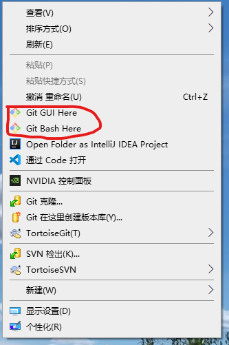
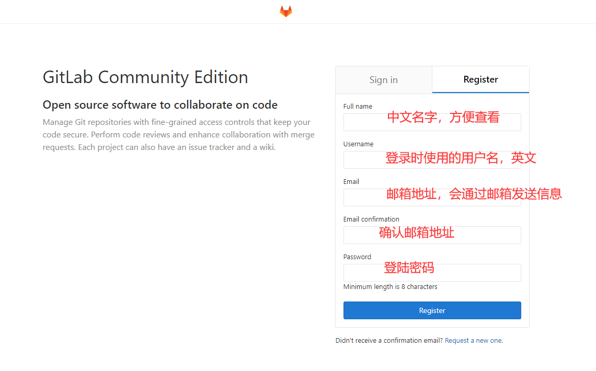
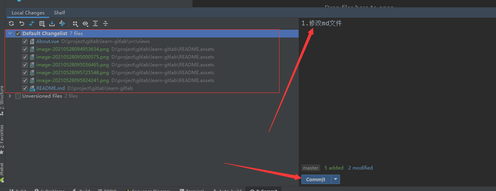
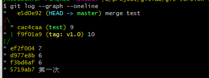

# GitLab的学习与使用

## 一、简介

### 1. 什么是Git

**Git**是目前世界上最先进的分布式版本控制系统（没有之一）。

**Git** 是一个开源的分布式版本控制软件,用以有效、高速的处理从很小到非常大的项目版本管理。 Git 最初是由*Linus Torvalds*设计开发的，用于管理Linux内核开发。Git 是根据GNU通用公共许可证版本2的条款分发的自由/免费软件。

Git本身完全可以做到版本控制，但其所有内容以及版本记录只能保存在本机，如果想要将文件内容以及版本记录同时保存在远程，就需要结合GitHub或者GitLab来使用。

### 2. 集中式、分布式

**集中式版本控制系统**，版本库是集中存放在中央服务器的，而干活的时候，用的都是自己的电脑，所以要先从中央服务器取得最新的版本，然后开始干活，干完活了，再把自己的活推送给中央服务器。中央服务器就好比是一个图书馆，你要改一本书，必须先从图书馆借出来，然后回到家自己改，改完了，再放回图书馆。


> 集中式版本控制系统最大的毛病就是必须联网才能工作，如果在局域网内还好，带宽够大，速度够快，可如果在互联网上，遇到网速慢的话，可能提交一个10M的文件就需要5分钟，这还不得把人给憋死啊。


**分布式版本控制系统**与集中式版本控制系统有何不同呢？首先，分布式版本控制系统根本没有“中央服务器”，每个人的电脑上都是一个完整的版本库，这样，你工作的时候，就不需要联网了，因为版本库就在你自己的电脑上。既然每个人电脑上都有一个完整的版本库，那多个人如何协作呢？比方说你在自己电脑上改了文件A，你的同事也在他的电脑上改了文件A，这时，你们俩之间只需把各自的修改推送给对方，就可以互相看到对方的修改了。

和集中式版本控制系统相比，分布式版本控制系统的安全性要高很多，因为每个人电脑里都有完整的版本库，某一个人的电脑坏掉了不要紧，随便从其他人那里复制一个就可以了。而集中式版本控制系统的中央服务器要是出了问题，所有人都没法干活了。

在实际使用分布式版本控制系统的时候，其实很少在两人之间的电脑上推送版本库的修改，因为可能你们俩不在一个局域网内，两台电脑互相访问不了，也可能今天你的同事病了，他的电脑压根没有开机。因此，分布式版本控制系统通常也有一台充当“中央服务器”的电脑，但这个服务器的作用仅仅是用来方便“交换”大家的修改，没有它大家也一样干活，只是交换修改不方便而已。


### 3. Git的三个区

Git有三个区，叫工作区，暂存区和版本库。


**工作区（working Directory）：**简单的理解你在电脑里能看到的目录。

**暂存区（stage）：**Git的版本库里存了很多东西，其中最重要的就是称为stage（或者叫index）的暂存区，还有Git为我们自动创建的第一个分支master，以及指向master的一个指针叫HEAD。

**版本库（Repository）：**工作区有一个隐藏目录.git，这个不算工作区，而是Git的版本库。

### 4. GitLab

GitLab是一个基于Git的项目管理软件。

#### 与GitHub的区别

GitLab是用来进行项目管理的软件，而Github同样可以实现版本控制，为什么不用更受欢迎的GitHub呢？或者说GitLab的适用场景与GitHub有什么区别呢？

二者在操作上基本相同，功能与底层实现上也差不多，但，如果你用GitHub，即便使用私有库，你的代码（存储在GitHub的服务器中）仍然掌握在别人手中（运营GitHub公司，目前是微软），对于一些对私密性要求较高的企业，这是无法忍受的。而GitLab则不同，GitLab是可以部署到自己的服务器上，数据库等一切信息都掌握在自己手上，适合团队内部协作开发，简单来说可把GitLab看作个人版的GitHub。

另外，GitLab的权限管理优于GitHub，GitLab的仓库有三种

- Private: 私人仓库，项目只有自己能看到，其他人都不能看到，包括系统管理员。
- Internal: 项目只有登录账户可看。
- Public: 项目即使是游客都能看到。

而GitHub的仓库只有公有库和私有库两种，GitHub协作者的操作权限都是一样的，而GitLab提供更细粒度的划分，仓库所有者可以给不同的开发者设置不同的权限(4种不同的角色)，共有5种角色。

- Guest：访客
- Reporter：报告者; 可以理解为测试员、产品经理等，一般负责提交issue等
- Developer：开发者; 负责开发
- Maintainer：开发者; 负责开发
- Owner：拥有者; 一般是项目经理

不同角色权限可在[官方文档上查到](https://docs.gitlab.com/ee/user/permissions.html#fn:1)

#### 权限

不同角色，拥有不同权限，下面列出Gitlab各角色权限

1. 工程权限

   | 行为                 | Guest | Reporter | Developer | Master | Owner |
   | -------------------- | ----- | -------- | --------- | ------ | ----- |
   | 创建issue            | ✓     | ✓        | ✓         | ✓      | ✓     |
   | 留言评论             | ✓     | ✓        | ✓         | ✓      | ✓     |
   | 更新代码             |       | ✓        | ✓         | ✓      | ✓     |
   | 下载工程             |       | ✓        | ✓         | ✓      | ✓     |
   | 创建代码片段         |       | ✓        | ✓         | ✓      | ✓     |
   | 创建合并请求         |       |          | ✓         | ✓      | ✓     |
   | 创建新分支           |       |          | ✓         | ✓      | ✓     |
   | 提交代码到非保护分支 |       |          | ✓         | ✓      | ✓     |
   | 强制提交到非保护分支 |       |          | ✓         | ✓      | ✓     |
   | 移除非保护分支       |       |          | ✓         | ✓      | ✓     |
   | 添加tag              |       |          | ✓         | ✓      | ✓     |
   | 创建wiki             |       |          | ✓         | ✓      | ✓     |
   | 管理issue处理者      |       |          | ✓         | ✓      | ✓     |
   | 管理labels           |       |          | ✓         | ✓      | ✓     |
   | 创建里程碑           |       |          |           | ✓      | ✓     |
   | 添加项目成员         |       |          |           | ✓      | ✓     |
   | 提交保护分支         |       |          |           | ✓      | ✓     |
   | 使能分支保护         |       |          |           | ✓      | ✓     |
   | 修改/移除tag         |       |          |           | ✓      | ✓     |
   | 编辑工程             |       |          |           | ✓      | ✓     |
   | 添加deploy keys      |       |          |           | ✓      | ✓     |
   | 配置hooks            |       |          |           | ✓      | ✓     |
   | 切换visibility level |       |          |           |        | ✓     |
   | 切换工程namespace    |       |          |           |        | ✓     |
   | 移除工程             |       |          |           |        | ✓     |
   | 强制提交保护分支     |       |          |           |        | ✓     |
   | 移除保护分支         |       |          |           |        | ✓     |

2. 组权限

   | 行为       | Guest | Reporter | Developer | Master | Owner |
   | ---------- | ----- | -------- | --------- | ------ | ----- |
   | 浏览组     | ✓     | ✓        | ✓         | ✓      | ✓     |
   | 编辑组     |       |          |           |        | ✓     |
   | 创建项目   |       |          |           | ✓      | ✓     |
   | 管理组成员 |       |          |           |        | ✓     |
   | 移除组     |       |          |           |        | ✓     |

#### 分支介绍

使用分支功能，可以更好的对项目进行开发，一般情况下，会将项目分为如下几个分支：

+ master分支：当release分支上测试通过，表示代码随时能够发布时，会将代码merge到maste分支，并且打上tag，至此，该版本封版，所有发现的bug均视为线上bug。

+ develop分支 ：开发者在接到需求之后主要从事开发工作的分支
+ release分支：测试在接到测试工作时主要使用的分支，在版本进入测试周期之后，会将该版本的测试代码从develop分支merge到release分支上，表示等待发布状态，此时将不会再添加新功能，只负责当前功能的bug修复。

+ hotfix分支：该分支适用于存在热修复功能的开发系统，当发现线上bug之后，如果该bug可以使用hotfix进行修复的，就会在hotfix分支上修复，并且进行测试。测试通过后并入maste分支，并且打上tag号。

+ 功能分支：功能分支是develop分支的辅助分支，将新功能在独立分支进行开发，开发完成后再并入develop分支。这样能够减少多人开发中，单个开发者由于新功能添加过程中修改代码对其他开发者造成的影响。

  > master分支永远是稳定的代码，未经测试的代码不得合并入master分支。该分支只负责发布，不负责开发以及bug修复。
  >
  > 在版本开发完成之后，代码会合并入release分支进行测试。release分支的所有提交应该不包含新业务的开发，只包含当前需要发布版本的bug修复。
  >
  > 线上版本出现问题分为两类，一类能用hotfix修复，我们会使用hotfix分支修复后合并入master并且打上tag，并且还需要将hotfix分支的修复内容merge到release或者develop分支上（如果在release上修复，需要记得合并到develop分支中）。还有一部分无法进行hotfix修复，这些bug的修复分支可以在release上，也可以在develop上（如果在release上修复，需要记得合并到develop分支中）。
  >
  > 功能分支属于辅助分支，当新功能开发完毕并且合并入develop分支之后就逐渐失去作用，等到包含该功能的版本进入测试阶段，并入release之后，我们可以删除该分支，否则时间久了将会积累非常多的功能分支，反而不方便管理。
  >
  > 有时候我们需要测试接入对功能模块的单独测试，所以测试可能直接使用功能分支代码进行测试，这时候的bug修复就需要在功能分支上进行修复。

#### 代码片段(Snippets)

使用GitLab的代码片段，保存一些项目使用到的公用代码片段，或者是host文件，或者是编辑器的配置文件，或者是环境的相关配置，再或者是对项目中某些工具类的使用片段等等，都可以保存在GitLab的代码片段中，项目其他成员都可以在GitLab上面看到，达到共享的目的。


## 二、 windows下安装git

1. 下载

   进入git官网[Git (git-scm.com)](https://git-scm.com/)

   

   点击Download xxxx for Windows，即可下载exe安装文件

   > 默认下载64位，如果需要32位，点击Downloads，寻找对应版本下载

2. 双击下载好的git安装包，弹出如图所示界面

   

3. 点击Next> 选择安装路径，如下图

   

   > 路径上面不要有中文！！！
   >
   > 路径上面不要有中文！！！
   >
   > 路径上面不要有中文！！！
   >
   > 

4. 选择好安装路径后，点击Next进入下一步，弹出安装配置窗口，如下

   

   > Additional icons 附加图标
   > 	On the Desktop 在桌面上
   > Windows Explorer integration  Windows资源管理器集成鼠标右键菜单
   > 	Git Bash Here
   > 	Git GUI Here
   > Git LFS (Large File Support)  大文件支持
   > Associate .git* configuration files with the default text editor  将 .git 配置文件与默认文本编辑器相关联
   > Associate .sh files to be run with Bash  将.sh文件关联到Bash运行
   > Use a TrueType font in all console windows  在所有控制台窗口中使用TrueType字体
   > Check daily for Git for Windows updates  每天检查Git是否有Windows更新

5. 上述配置之后，点击Next进入下一步，弹出出 选择开始菜单文件夹 的窗口，如下图

   

6. 点击 Next 进入下一步，进入 选择Git使用的默认编辑器 窗口

   

   > Use the Nano editor by default  默认使用 Nano 编辑器
   > Use Vim (The ubiquitous text editor) as Git's default editor  使用 Vim 作为 Git 的默认编辑器
   > Use Notepad++ as Git's default editor  使用 Notepad++ 作为 Git 的默认编辑器
   > Use Visual Studio Code as Git's default editor  使用 Visual Studio Code 作为Git 的默认编辑器
   > Use Visual Studio Code Insiders as Git's default editor  使用Visual Studio Code Insiders 作为 Git 的默认编辑器

7. 点击 Next 进入下一步，进入 调整Path环境变量窗口 

   

   > Use Git from Git Bash only
   > This is the safest choice as your PATH will not be modified at all.You will only be able to use the Git command line tools form Git Bash.
   > 这是最安全的选择，因为您的PATH根本不会被修改。您只能使用 Git Bash 的 Git 命令行工具。
   >
   > Use Git from the Windows Command Prompt
   > This option is considered safe as it only adds some minimal Git wrappers to your PATH to avoid cluttering your environment with optional Unix tools . You will be able to use Git from both Git Bash and the Windows Command Prompt.
   > 这个选项被认为是安全的，因为它只向PATH添加一些最小的 Git包，以避免使用可选的Unix工具混淆环境。 您将能够从 Git Bash 和 Windows 命令提示符中使用 Git。
   >
   > Use Git and optional Unix tools from the Windows Command Prompt
   > 从Windows命令提示符使用Git和可选的Unix工具
   > Both Git and the optional Unix tools will be added to you PATH
   > Git和可选的Unix工具都将添加到您计算机的 PATH 中
   >
   > Warning:This will override Windows tools like "find and sort".Only use this option if you understand the implications.
   > 警告：这将覆盖Windows工具，如 “ find 和 sort ”。只有在了解其含义后才使用此选项

8. 点击 Next 进入下一步，

   

   > Use the OpenSSL library
   > 使用 OpenSSL 库
   > Server certificates will be validated using the ca-bundle.crt file.
   > 服务器证书将使用ca-bundle.crt文件进行验证。
   >
   > Use the native Windows Secure Channel library
   > 使用本地 Windows 安全通道库
   > Server certificates will be validated using Windows Certificate Stores.This option also allows you to use your company's internal Root CA certificates distributed e.g. via Active Directory Domain Services.
   > 服务器证书将使用Windows证书存储验证。此选项还允许您使用公司的内部根CA证书，例如， 通过Active Directory Domain Services 。

9. 点击 Next 配置行结束符 配置窗口

   

   > Checkout Windows-style,commit Unix-style line endings
   > Git will convert LF to CRLF when checking out text files.When committing text files,CRLF will be converted to LF .For cross-pltform projects,this is the recommended setting on Windows ("core.autocrlf" is set to "true")
   > 在检出文本文件时，Git会将LF转换为CRLF。当提交文本文件时，CRLF将转换为LF。 对于跨平台项目，这是Windows上推荐的设置（“core.autocrlf”设置为“true”）
   >
   > Checkout as-is , commit Unix-style line endings
   > Git will not perform any conversion when checking out text files. When committing text files, CRLF will be converted to LF. For cross-platform projects,this is the recommended setting on Unix ("core.autocrlf" is set to "input")
   > 在检出文本文件时，Git不会执行任何转换。 提交文本文件时，CRLF将转换为LF。 对于跨平台项目，这是Unix上的推荐设置 （“core.autocrlf”设置为“input”）
   >
   > Checkout as-is,commit as-is
   > Git will not perform any conversions when checking out or committing text files.Choosing this option is not recommended for cross-platform projects ("core.autocrlf"is set to "false")
   > 在检出或提交文本文件时，Git不会执行任何转换。对于跨平台项目，不推荐使用此选项（“core.autocrlf”设置为“false”）

10. 点击 Next 进入下一步，配置终端模拟器，

    

    > Use MinTTY (the default terminal of MSYS2)
    > Git Bash will use MinTTY as terminal emulator,which sports a resizable window,non-rectangular selections and a Unicode font. Windows console programs (such as interactive Python) must be launched via 'winpty' to work in MinTTY.
    > Git Bash将使用MinTTY作为终端模拟器，该模拟器具有可调整大小的窗口，非矩形选区和Unicode字体。 Windows控制台程序（如交互式Python）必须通过'winpty'启动才能在MinTTY中运行。
    >
    > Use Windows' default console window
    > Git will use the default console window of Windows ("cmd.exe"),which works well with Win32 console programs such as interactive Python or node.js , but has a very limited default scroll-back,needs to be configured to use aUnicode font in order to display non-ASCII characters correctly,and prior to Windows 10 its windows was not freely resizable and it only allowed rectangular text selections.
    > Git将使用Windows的默认控制台窗口（“cmd.exe”），该窗口可以与Win32控制台程序（如交互式Python或node.js）一起使用，但默认的回滚非常有限，需要配置为使用unicode 字体以正确显示非ASCII字符，并且在Windows 10之前，其窗口不能自由调整大小，并且只允许矩形文本选择。

11. 点击 Next 进入下一步，配置额外选项

    

    > Enable file system caching
    > 启用文件系统缓存
    > File system data will be read in bulk and cached in memory for certain operations ("core.fscache" is set to "true"). This provides a significant performance boost.
    > 文件系统数据将被批量读取并缓存在内存中用于某些操作（“core.fscache”设置为“true”）。 这提供了显着的性能提升。
    >
    > Enable Git Credential Manager
    > 启用Git凭证管理器
    > The Git Credential Manager for Windows provides secure Git credential storage for Windows,most notably multi-factor authentication support for Visual Studio Team Services and GitHub. (requires .NET framework v4.5.1 or or later).
    > Windows的Git凭证管理器为Windows提供安全的Git凭证存储，最显着的是对Visual Studio Team Services和GitHub的多因素身份验证支持。 （需要.NET Framework v4.5.1或更高版本）。
    >
    > Enable symbolic links
    > 启用符号链接
    > Enable symbolic links (requires the SeCreateSymbolicLink permission).Please note that existing repositories are unaffected by this setting.
    > 启用符号链接（需要SeCreateSymbolicLink权限）。请注意，现有存储库不受此设置的影响。

12. 点击 Install 开始安装

    

13. 安装完成

    

14. 找空白文件夹，右键出现如下图所示菜单，则安装成功

    

> 出现菜单的数量，和第4步当中选择的项匹配，如果都没有选，则不会出现。

15. 全局配置git

    在空白处，右键，选择 Git Bash Here，弹出命令窗口，输入以下命令

    ``` shell
    git config --global user.name "你的姓名"  # 全局配置你的姓名
    git config --global user.email "你的邮箱"  # 全局配置你的邮箱  邮箱要与GitLab注册账号的一致
    ```

16. 设置git为大小写敏感

    由于git默认设置为大小写不敏感，当修改英文字母大小写的时候，git不会检测出你有修改，我们需要将git设置为大小写敏感。

    进入项目，执行命令

    ``` shell
    git cconfig core.ignorecase false  # 将git设置为大小写敏感
    ```

    


## 三、 使用GitLab

### 1. centos部署GitLab

#### 硬件要求

最低配置：2核2G内存以上，

> 2G内存运行的时候，会直接卡掉，导致访问GitLab失败。

官方推荐配置

- **4核 4GB内存** 支持500个用户
- **8核 8GB内存** 支持1000个用户

#### 安装

1. 安装依赖

   ``` shell
   yum install postfix  # 安装Postfix以发送通知邮件
   systemctl enable postfix  # 将Postfix服务设置为开机自启动
   systemctl start postfix # 启动Postfix
   ```

2. 添加GitLab镜像

   ``` shell
   wget https://mirrors.tuna.tsinghua.edu.cn/gitlab-ce/yum/el7/gitlab-ce-10.0.0-ce.0.el7.x86_64.rpm
   ```

3. 安装GitLab

   ``` shell
   rpm -i gitlab-ce-10.0.0-ce.0.el7.x86_64.rpm
   ```


出现上图样式，代表安装成功

4. 修改ip与端口

   修改文件 /etc/gitlab/gitlab.rb

   ``` shell
   external_url 'http://localhost:3333'  # 服务器ip:端口
   ```

5. 重启GitLab

   ``` shell
   gitlab-ctl reconfigure # 重新配置GitLab
   gitlab-ctl restart # 重新启动GitLab
   ```

6. 配置邮件发送

   我配置的是腾讯企业邮箱，一下配置按照腾讯企业邮箱为例

   修改配置文件/etc/gitlab/gitlab.rb文件

   ``` shell
   gitlab_rails['gitlab_email_from'] = 'yangxuchen@yangxuchen.com' # 我自己的企业邮箱地址
   gitlab_rails['smtp_enable'] = true
   gitlab_rails['smtp_address'] = "smtp.exmail.qq.com"  # 腾讯企业邮箱的stmp地址
   gitlab_rails['smtp_port'] = 465 # 端口
   gitlab_rails['smtp_user_name'] = "yangxuchen@yangxuchen.com"
   gitlab_rails['smtp_password'] = "xxxx" # 域名邮箱地址，如果不知道，登陆企业邮箱 设置->账户->账户安全->修改密码 重新设置
   gitlab_rails['smtp_domain'] = "yangxuchen.com"  # 企业邮箱的域名
   gitlab_rails['smtp_authentication'] = "login"
   gitlab_rails['smtp_enable_starttls_auto'] = true
   gitlab_rails['smtp_tls'] = true
   user['git_user_email'] = "yangxuchen@yangxuchen.com" # 如果不设置，会报错gitlab SMTPSyntaxError: 501 mail from address must be same as authorization user
   ```

   修改完配置文件之后，执行

   ``` shell
   gitlab-ctl reconfigure
   ```

   让配置文件生效，

   测试：

   ``` shell
   gitlab-rails console  # 进入控制台交互界面，有点慢，等待出现下一行之后，在输入
   Notify.test_email('yoyo_你自己随便邮箱@qq.com', '邮件标题_test', '邮件正文_test').deliver_now # 如果可以收得到邮件，则配置成功
   ```

   

7. 相关命令

   ``` shell
   # 运维管理
   cat /opt/gitlab/embedded/service/gitlab-rails/VERSION # 查看版本
   gitlab-ctl tail # 实时查看日志
   gitlab-ctl tail 模块名 # 查看模块日志
   gitlab-rake db:migrate # 数据库关系升级
   gitlab-rake cache:clear # 清理redis缓存
   yum update gitlab-ce # 升级GitLab-ce版本
   gitlab-ctl pg-upgrade # 升级PostgreSQL最新版本
   # 服务器控制命令
   gitlab-ctl start # 启动gitlab所有组件
   gitlab-ctl stop # 停止gitlab所有组件
   gitlab-ctl restart # 重启gitlab所有组件
   # GitLab模块redis/postgresql/gitlab-workhorse/logrotate/nginx/sidekiq/unicorn
   gitlab-ctl start 模块名 # 启动制定模块组件
   gitlab-ctl stop 模块名 # 停止制定模块组件
   gitlab-ctl status # 查看服务状态
   gitlab-ctl reconfigure # 修改配置之后执行，将配置生效并启动服务
   ```

#### GitLab服务构成

GitLab由主要由以下服务构成，他们共同承担了Gitlab的运作需要

+ nginx: 静态web服务器
+ gitlab-shell: 用于处理Git命令和修改authorized keys列表
+ gitlab-workhorse: 轻量级的反向代理服务器
+ logrotate：日志文件管理工具
+ postgresql：数据库
+ redis：缓存数据库
+ sidekiq：用于在后台执行队列任务（异步执行）
+ unicorn：HTTP服务，GitLab Rails应用是托管在这个服务器上面的。

#### 主要配置文件目录

+ 主配置文件: /etc/gitlab/gitlab.rb
+ 文档根目录: /opt/gitlab
+ 默认存储库位置: /var/opt/gitlab/git-data/repositories
+ Nginx配置文件: /var/opt/gitlab/nginx/conf/gitlab-http.conf
+ Postgresql数据目录: /var/opt/gitlab/postgresql/data

> 参考[gitlab常用命令 - Ray_chen - 博客园 (cnblogs.com)](https://www.cnblogs.com/ray-mmss/p/10861703.html)

### 2. 第一次访问


第一次登陆时，会要求新设置root的密码设置之后，可以使用root账号登陆


### 3. 添加账号

GitLab添加账号有两种方式，管理员添加与注册

1. 管理员添加

   

   管理员按照上图操作，添加并填写相关用户信息，即可完成添加用户

   如果已经配置邮件发送，并且添加用户时候的邮箱正确，在那个邮箱中会收到邮件

   

   点击其中的Click here to set your password，重新设置密码

   

   设置密码之后，即可登陆GitLab

2. 注册

   GitLab可以通过注册的方式，来提供用户获取账号

   

   如图所示，填写相关信息，点击Register即可注册

### 4. 配置SSH Key

为了方便用户提交代码的时候，不使用密码认证，我们需要配置SSH Key，来达到无密码认证的目的。

1. 检查本机上是否存在SSH Key

   sshKey一般存在电脑的C:\User\你的用户名\.ssh目录下，目录结构如图所示：

   ![id ub  known h05 ](data:image/png;base64,iVBORw0KGgoAAAANSUhEUgAAAPAAAABSCAIAAADl484gAAAAAXNSR0IArs4c6QAAAARnQU1BAACxjwv8YQUAAAAJcEhZcwAADsMAAA7DAcdvqGQAAAZzSURBVHhe7Z2/chpXFIdXiVQ4tR4BVGgoVDgNfgGBGo0zw4zT0OF4kgw0qixnUqiIRw0kbkQnTayZUDHjAE8ARdwyFIanSNJFgpxz/7AXsaykvfLu6vL7LK3u3r27qPj809kdjrQxm808AFzhC/UVACeA0MApIDRwCggNnAJCA6eA0MApIDRwCggNnAJCA6eA0MApIDRwCggNnAJCA6eA0MApIDRwiujvh768vJzSydObG9p+9eTJ/v7+9va2WgpAXEQX+vf377998UKO+RL6Mq3WH3t7e399/HhQLMJpEDPRSw4KY9peT6fX1/TBXIkPmiSPv3769MOHP8VCAOLDQmgZ7TPxz4fHFxcXvV7v73//kVMLTBrPNp41JmrPp/cycBqAexFdaCqWaatsNqR+/vyb73/4sVqtzcQCAOLEJqG1sGZEG+PpjGuSm2Sq/Vm/mlF7ADwsFglNJQfJa9pMkusBfyKhQezY3hSaNusdXV0HPj/hGvplT+1Q4awpNtXcTeQJYqUosnlfoa8TMAXWFLuEZmhLKrO92mf5hYrsoJLDhxwtel0+k+hW1GwgzWL7kBZRqTJplGs5fdJZgQ9OGqfeuZzoVppFKL3W2CS0VJnrDO2wMFuP/WEgvXYzXz8SShKFwzCjK13pLpXgOznSe+GBSKZ6VvVkRq+MebAu2CS0NHoOC6x2hcvBN4W2FM74f8q5VyZ//RKkLDN6XM+rZWBNsUhoGcBssUTMink5vOWmkDJ5UDudV8EndwvXSaPBp2SqfZJ3MBp73ng0yNfPxXOTSac1EKvA2mKR0OSriGRDW8Nrv8heReGMS16uFDhhS6FF9JxMdactT8lSLc2FSOGo7tWyYqo8yiGh15zo7+X47d27V9+9+u/qineWrrK1tfnL27dvXr9W+wDEgtVTDgrozc0v+WNrkww2P3gBnkOD2Ime0PXGr3xfyF7LN42KnYWJ2c8/vVGr7wo/yzOr6UpXPZwD4C7g90MDp4hecgCQQiA0cAoIDZwCQgOnQJMscAo0yQKniF5yUBjTFk2yIFVYCC2jXb2hYw6PH22TrGwmUDvgMRJdaCqWaatsNqRGkyxIEJuE1sKaEW2Mp2iSBbFjkdBUcpC8ps0kuR7wJxIaxI7tTaFps97R1XXg85OFMjWGJlnjdIFaYH4b5phZWgweD3YJzdCWVGZ7tc/yS4qaZNXpqxeY3GsxSBs2CS1V5jpDOyzM1mN/GEiMTbL+6YWjer7ZDpX0XotB2rBJaGn0HBZY7QqXg28KbUGTLAjDIqFlALPFEjEr5uXwlpvCz9oky5b7KT6PWS5YBpVDlcDDT2LBjdbaFYvB48AioclXEcmGtobXfpG9iviaZCuecY6svDPVc33ajbMCFoPHg/NNspTV2dExxFwXrJ5yUECjSRakCuebZJHQ6wWaZIFTRC85AEghEBo4BYQGTgGhgVOgSRY4BZpkgVNELzkojGmLJlmQKiyEltGu3tAxh8dhTbLifUOJvsu4h79Z6zDRhaZimbbKZkNqNMmCBLFJaC2sGdHGePpZ3g+dOIn/hAFhWCQ0lRwkr2kzSa4H/ImEBrFje1No2qx3dHV96/MTDjvZiSrq2oZqTjUqXL9fdd6xapTAfHRxdtV1lujoC/thG/BahPweBTRJa7K1ATeByasvHgXJY5fQDG1JZbZX+yy/3NYky260SmPd6uoNaiPRnDque7WyUJFWFId1WiHoekUhTXZXdqrQ8fYwn5dtJ9ygWDoQv+1j+TrL+GvyzZOQ1yJhF3tyC2eizatCU8EduyBhbBJaqsx1hnZYmK3H/nCZtuz4Nn/jjO6YzRyUZAOJ6KKVvVWMblnl46JNinwunR/nWp2JN/k01D4vXyeAu75WUE+uQfhRkAQ2CS2NnsMCq13hcshNYXM4zOuWvvuQ381KC+lc9vkgk931Wp1ep+Vpnx8M8VrLPbkLhB8FCWCR0DKA2WKJmBXzchhyU1g57vfHpVY2tPAUXbR+0dA7rSlryWivVT5p5nYycnxi7fOq11ruyTUJPwqSwCKhyVcRyYa2htd+kb0C/iV3XKuuvp2i/OvmVP/rBpcoukJhiweqIVuM7fN5xWst9+SKHxDqpjDgKEgY55tkwXph9ZSDAhpNsiBVpK1J9sHh53H407TrA5pkgVNELzkASCEQGjgFhAZOAaGBU0Bo4BQQGjgFhAYO4Xn/A4l7yJn9EYdRAAAAAElFTkSuQmCC)

   + id_ras：私钥
   + id_rsa.pub：公钥，要添加到GitLab中的文件

2. 如果不存在上面目录中的私钥和公钥，依次执行下面命令

   ``` shell
   ssh-keygen -t rsa -C "这里写你再gitlab上面注册账号时的邮箱"
   ```

   然后一路回车，完成之后，会在C:\User\用户名\\.ssh目录下生成上面所示的公钥和私钥。

3. 添加公钥

   

   如上图所示，按照步骤，依次点击，在第三步时，填入.ssh目录下的公钥(id_rsa.pub)中的文本内容

   

   添加成功之后，会显示你的SSH Keys

### 5. 用户组

为了方便用户管理，GitLab提供了用户组的概念，创建组，将同样权限职能的用户添加到同一个组当中，给组来添加相对应的权限与项目，就不必要每次给项目添加用户的时候，选择每一个开发者，直接添加一个组。

1. 创建组

   使用管理员账号登陆，

   

   按照图片依次点击，新增组

   

   ​	按照描述添加好组之后，就可以给组当中添加成员了

   	

   ​	选择点击要添加成员的组，即可按照图片说明添加成员

   

### 6. 创建项目

到现在为止，用户创建了，就可以创建项目了！

账号刚刚登陆，没有项目的情况下，显示如图界面


如果存在项目，显示如下图所示界面


点击new Project，填写相关信息，即可创建项目


### 7. 初始化项目

创建项目之后，项目可以通过三种方式初始化，分别是：创建新的存储库，将现有文件夹设置为存储库，从现有的Git存储库上传到GitLab中

1. 创建新的存储库（使用learn-gitlab项目做师范）

   + 进入项目，可以看到项目的ssh地址

     

   + 执行命令

     ``` shell
     git clone ssh://git@gitlab.od.com:2222/root/learn-gitlab.git  # 克隆仓库
     cd learn-gitlab # 进入克隆下来的目录中
     touch README.md # 创建README.md文件
     git add README.md # 将README.md文件加到暂存区
     git commit -m "add README" # 提交暂存区的修改，-m "这里是你的提交信息，要写明白你本次提交的修改内容"
     git push -u origin master # 推送到远端
     ```

2. 将现有文件夹设置为存储库

   ``` shell
   cd existing_folder # 进入现有的文件夹
   git init # 初始化git仓库
   git remote add origin ssh://git@gitlab.od.com:2222/root/learn-gitlab.git # 设置远端地址
   git add . # 将所有文件加入暂存区
   git commit -m "Initial commit" # 提交暂存区的修改
   git push -u origin master # 推送到远端
   ```

3. 将现有的git仓库推动到GitLab

   ``` shell
   cd existing_repo # 进入现有的git仓库
   git remote rename origin old-origin # 移除旧的源
   git remote add origin ssh://git@gitlab.od.com:2222/root/learn-gitlab.git # 设置新的源
   git push -u origin --all  # 将本地的所有分支都推送到远程主机
   git push -u origin --tags  # 将所有推动到远程主机
   ```

> 在推送之前，要先配置SSH Key

### 8. 克隆项目

1. 进入项目首页，复制SSH地址

   

2. 在电脑上面，找一个文件夹，右键的打开git命令窗口

   

3. 执行命令

   ``` shell
   git clone ssh://git@gitlab.od.com:2222/root/learn-gitlab.git # 克隆
   ```

   

4. 克隆成功

   

   

   > 克隆项目，首先你要有克隆项目的权限！！！

### 9. 项目提交

1. 在项目文件打开git命令窗口

   

2. 提交到暂存区

   ``` shell
   git add . # 将所有修改的文件提交到暂存区
   ```

   

3. 提交到本地

   ``` shell
   git commit -m "提交信息"  # 在-m后面，一定要加上提交信息，方便查看
   ```

   

4. 推送到远端

   推动到远端的时候，我们可以选择推送到远端的某一个分支，

   这里以直接推送到master分支为例，推送到其他分支，在稍后的分支当中说明。

   > 不用角色对不用分支的权限时不一样的，在推送之前，先确定你拥有对这个分支的修改权

   ``` shell
   git push origin master # 将当前分支推送到远端的master分支
   ```

   

5. 使用VSCode提交项目

   

   在VSCode中，打开源代码管理，会显示出有更改的文件，选择对应文件，鼠标放上去后，会有三个按钮，从左到右依次是：打开文件、放弃修改、添加到暂存区

   

   将要提交的文件提交到暂存区之后，才上方的消息输入框中输入修改信息，点击上方的提交按钮，即可完成提交到本地操作

   

   推送到远端：点开源代码管理器，右上角三个点，弹出菜单，点击推送，即可推送到远端，默认推送到master分支。默认分支在左下角显示。

   

6. 使用idea进行项目提交

   

   点击git管理工具条中的第二个对勾按钮，弹出提交窗口

   

   勾选对应修改列表中的文件，在右侧输入修改内容，点击commit即可提交到本地

   

   点击点个向上的绿色箭头，推送到远端，默认推送到远端的master分支，点击推送按钮之后，会显示本地修改的版本，点击右下角Push，即可完成推送

   

   默认分支在右下角显示

   

   

   

   

### 10. 项目拉取

1. 在拉取远端分支之前，要保证本地分支的暂存区没有，首先要将所有在暂存区的文件，全部提交到本地分支

2. 拉取

   ``` shell
   git pull origin master # 拉取远端的master分支，并与本地当前分支合并
   ```

   

3. 使用VSCode拉取项目

   

   在VSCode中，打开源代码管理，点击右上角三个点，弹出菜单，点击拉取，即可拉取新的分支，默认拉取master分支，当前分支在右下角显示

   

4. 使用idea拉取项目

   使用idea打开有git管理的项目，idea会在界面中显示git管理工具条

   

   点击左边的向下的蓝色箭头，选择对应的选项，即可拉取项目，默认拉取master分支，分支在idea右下角显示

   

   > Merge incoming changes into the current branch：将传入的更改合并到当前分支中
   >
   > Rebase the current branch on top of incoming changes：在传入更改的基础上重新设置当前分支。

### 11. 合并文件

1. 在拉取项目之后，如果出现自动合并文件失败，会有以下提示

   

   代表src/views/Home.vue文件自动合并失败，我们需要手动合并

2. 使用普通文本编辑器合并

   找到需要手动合并地方

   

   如图所示，<<<<<<< HEAD这个标志代表开始，后面的>>>>>>> 87a88d11d18fd884d2202b9ea48663329b0815e2 代表与87xxx这个版本发生了冲突，======= 上面的是你本地的修改，下面是远端的修改，按照项目需要，删除多余的部分，然后提交，推送到远端。

3. 使用VSCode合并

   

   在VSCode中，点击源代码管理，如果有需要手动合并，会自动监测出来，放在合并更改选项当中，打开对应的文件，VSCode会给你标出需要解决合并的地方，有四个选项

   + 采用当前更改：保留我自己本地的修改，覆盖远端的修改
   + 采用传入的更改：保留远端的修改，覆盖本地的修改
   + 保留双方更改：会将我的修改放在前面，远端的修改放在后面，两个都保留
   + 比较变更：更详细的比较远端文件和本地文件的不同。

   修改对应文件之后，提交，并且推送。

   > VSCode会自动给生成合并的提交信息，不需要修改，直接提交即可

4. 使用idea合并

   使用idea拉取项目之后，如果有自动合并失败的文件，idea会显示合并窗口，如下图所示

   

   如果不小心关闭了，在Commit窗口中，红色显示的文件，为合并失败的文件，点击上方的Resolve，即可弹出合并窗口

   

   在合并窗口中，双击对应的文件，弹出文件合并编辑窗口，如下图所示

   

   在文件合并编辑窗口中，一共分三栏，左边是我本地的修改，中间是合并结果，右边是远端的修改，

   idea将文件的修改分块，点击对应的双箭头，即可将代码块添加到中间的合并结果中，如果对idea的代码分块不满意，可以对中间的合并结果进行编辑，冲突解决完成之后，点击右下角的apply，即可完成合并。

### 12. 创建分支

1. 使用GitLab创建分支

   1. 进入项目首页，按照图片提示点击创建分支

      

      填写分支名称和分支来源之后，创建新分支

      


### 13. 推送到对应分支

> 在推送之前，要保证分支已经创建

1. git命令方式

   1. 拉取远端分支

      ``` shell
      git pull origin <远程分支名>:<本地分支名>  # 本地分支名称可以和远程分支名称保持一致
      ```

      

   2. 切换到拉取下来的分支

      ``` shell
      git checkout <分支名称>  # 切换到对应分支
      ```

      

   3. 在当前文件中进行提交

   4. 提交到远端

      ``` shell
      git push orgiin <远端分支名>:<本地分支名> # 将本地分支推送到对应的远端分支中，如果分支名称相同，可以只写一个
      ```

      

   

   ``` shell
   git push origin master:test-branch  # 将本地的master分支推送到远端的test-branch分支中
   ```


### 14. 合并分支

1. 创建合并请求

   在项目首页，点击分支，切换到对应分支中

   

   点击创建合并请求

   

   填写合并请求相关信息

   

2. master处理合并请求

   master进入项目首页，点击Merge Requests，进入合并请求管理界面，点击对应的请求

   

   点击下方对应按钮，可以合并，合并并关闭请求，废弃请求

   

## 四、git相关命令

### 1. git init

​	git init 命令用于在目录中创建新的Git仓库

### 2. git clone

​	git clone 用于将一个远程的Git仓库拷贝到本地

​	命令格式如下

``` shell
git clone [url]  # url为远程git仓库地址
```

### 3. git add

​	git add 命令用于将修改的文件添加到暂存区

​	命令格式如下

``` shell
git add [file1] [file2] ... 
```

 	可以加多个参数，每个参数都是一个文件或者文件夹，当参数为文件夹的时候，会添加文件夹下面的子目录及文件

​	添加当前目录下所有文件，可以使用

``` shell
git add .
```

### 4. git status

​	git status 命令可以查看在上次提交之后，是否对文件进行过修改


​	加后缀-s可以显示简短的显示


### 5. git diff

​	git diff 命令可以比较文件的不同，比较的是暂存区文件与工作区文件

``` shell
git diff --staged [file] # 查看暂存区与上一次提交的差异
git diff --cached [file] # 查看暂存区与上一次提交的差异
```

### 6. git commit

​	git ccommit 命令用于将暂存区的文件添加到本地仓库中

``` shell
git commit -m "修改信息" # 将暂存区所有文件都提交到本地仓库
git commit [file1] [file2] ... -m "修改信息" # 将制定文件提交到本地仓库
git commit -a # 将工作区所有修改提交到本地仓库
```

### 7. git reset

​	git reset 命令用于回退版本，可以指定退回某一个提交的版本

``` shell
git reset HEAD^ # 撤销最近的一次提交，工作区内容保持不变
git reset --head HEAD^ # 撤销最近一次的提交，工作区内容变为上一次提交内容
git reset --soft HEAD [版本号] # 回退到制定版本，工作区内容保持不变
```

+ HEAD：代表当前版本

+ HEAD^：代表上一版本

+ HEAD^^：代表上上版本

+ HEAD^^^：代表上上上版本

  ... 以此类推

  同样，也可以使用数字来代替

+ HEAD~0：代表当前版本

+ HEAD~1：代表上一版本

+ HEAD~2：代表上上版本

+ HEAD~3：代表上上上版本

> 使用git reset命令会将提交撤销，不可恢复

### 8. git rm

​	git rm 命令用于删除文件

> 如果只是简单地从工作目录中手工删除文件，运行 **git status** 时就会在 **Changes not staged for commit** 的提示。

``` shell
git rm <file> # 将文件从暂存区和工作区中删除   如果修改过的话，就需要加上-f，强制删除
git rm --cached <file> # 将文件从暂存区中移除
```

### 9. git log

​	git log 命令用于查看历史提交记录

``` shell
git log  # 查看历史提交记录
git blame <file> # 以列表形式查看制定文件的历史修改记录
```

git log 相关参数

+ --oneline：使用简洁方式来显示日志，一行

+ --graph：开启拓扑图选项，更方便的查看项目中分支情况

+ --reverse：时间正序显示

+ --author=<用户名>：显示某一个制定用户的提交

+ --before= {<时间>} --before={<时间>}：查看某一个时间段内的提交

+ --no-merges：隐藏合并提交

  

### 10  git remote

​	git remote 命令用于远程仓库操作

``` shell
git remote -v # 查看远程仓库信息
git remote show [remote] # 查看某一个远程仓库的详细信息
git remote add [shortname] [url] # 增加一个远程仓库，shortname为本地的版本库
git remote rm [name] # 删除远程仓库
git remote rename [old_name] [new_name] # 修改远程仓库名
```

### 11. git fetch

​	git fetch 命令用于从远程仓库获取代码

> 该命令只获取远程分支信息，并不合并

``` shell
git fetch [alias] # 获取远程仓库信息，alias为远程仓库名称
git merge [alias]/[branch] # 将从远程仓库获取到的信息，合并到本地仓库的任意分支
```

### 12. git pull

​	git pull 命令用于从远程仓库获取代码并合并到本地仓库中

> git pull 骑士就是 git fetch 和 git merge 的简写

``` shell
git pull <远程主机名> <元亨分支名>:<本地分支名> # 将远程仓库的某一个分支下载并合并到本地某一个分支
git pull <远程主机名> <分支名>  # 当远程分支和本地分支名称一致的时候，可以省略一个
git pull  # 默认拉起origin主机的master分支
```

### 13. git push

​	git push 命令用于从本地版本库的某一个分支上传到远程并合并

``` shell
git push <远程主机名> <本地分支名>:<远程分支名>  # 将本地的某一个分支推送到远程的某一个分支，并合并
git push <远程主机名> <分支名>  # 若远程分支和本地分支同名，可以省略一个
git push  # 默认推送本地的master分支到origin的master分支上面，并合并
```

​	相关参数

+ --force：如果本地版本和远程版本有差异，但又要强行推送，可以加上--fore

+ --delete：删除分支

  ``` shell
  git push origin --delete test  # 删除origin主机的test分支
  ```

### 14. git branch

​	git branch 命令用于在本地创建一个新的分支

``` shell
git branch [branch_name]  # 创建一个新的分支
git branch -a  # 查看所有分支
git branch   # 列出本地所有分支
git branch -r  # 查看远程仓库分支列表
git branch -d [branch_name]  # 删除指定分支
git branch -m [old_name] [new_name]  # 给分支重命名
```

### 15 git checkout

​	git checkout 命令用于切换分支，与操作文件

``` shell
git checkout [branch_name]  # 切换稻另一个分支
git checkout [file_name]  # 放弃某一个文件的修改  只能放弃工作区的修改
git checkout .  # 放弃当前目录下的修改
git checkout -b [branch_name]  # 如果分支存在，就只切换分支，如果分支不存在，先创建分支， 然后在切换
git checkout [commit_id] [file_name]  # 从指定提交当中，签出指定文件   会覆盖工作区当中的文件
git checkout [branch_name] [file_name]  # 从指定分支当中，签出指定文件   会覆盖工作区中的文件
# file_name  可以使用通配符   *.css：目录下所有css文件    css/：签出某个目录下的文件
```

### 16. git merge

​	git merge 用于合并分支，如果自动合并失败，需要手动解决

``` shell
git merge [branch_name]  # 将分支合并到当前分支当中
```

### 17. git tag

​	git tag 命令用于给某次提交打上一个标签，如果你达到一个重要的阶段，并希望永远记住那个特别的提交快照，你可以使用 git tag 给它打上标签。

``` shell
git tag -a [tag]  # 给当前提交打标签   然后会打开编辑器，让你出入标签注释
git tag -a [tag] [commit_tag]  # 给指定提交添加标签
```

打了标签之后，查看日志，就可以查看到对应标签，如图，可以看到f9f01a9打上了v1.0标签

